<!-- Animated gradient banner -->

<!-- Typing animation -->

<!-- Social badges -->

## 🛡️ The Mission

I'm a **relentless technology enthusiast** and CSE student operating at the intersection of **Agentic AI**, **Cybersecurity**, **Machine Learning**, and **Distributed Systems**. I thrive on high-friction challenges and turning complex patterns into robust, production-ready code.

## 🚀 Projects in Development

- 🔭 **Currently building:**
  - **Viora** — an AI-powered medical assistance suite (patient app, doctor copilot, hospital system, research platform)
  - **AgentShield** — a security framework for agentic AI, mitigating prompt injection & memory poisoning
  - **Rufus** — a budget ESP32-based quadruped companion robot with an agentic voice/vision brain
  - **Rook** — extracting high-value insight from digital content and businesses
- 🌱 **Currently learning:** DevOps (Docker/K8s), AI × Blockchain convergence
- 👯 **Open to collaborate on:** Open-source AI Security or High-Performance Computing projects
- 💬 **Ask me about:** Agentic workflows, LangGraph, Java/Python backends, React
- ⚡ **Traits:** High productivity · Fast learner · Creative problem-solving

## 🛠️ Technical Arsenal

  

## 📊 System Status

### 🏆 Trophies

### 🐍 Contribution Snake

*(Binary is temporary, code is forever.)*

